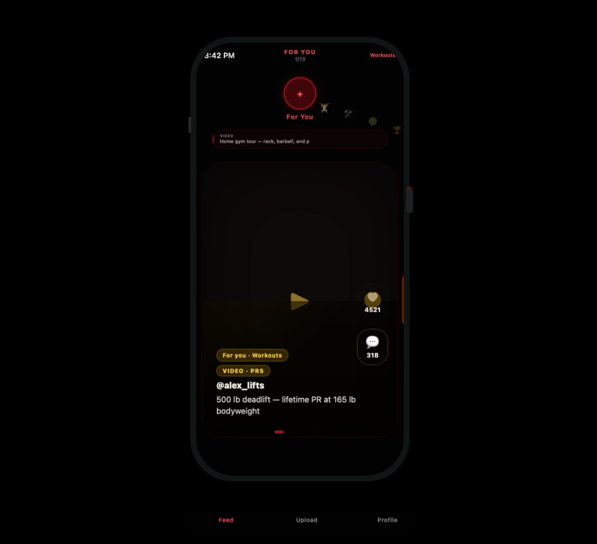

# GymTok — Interview Repository (Everything)

**Private repo for interviews** · Full codebase + docs + screenshots + live demo

| | |
|--|--|
| **Live demo** | https://gym-tok-demo-v3.vercel.app |
| **Start here** | [docs/INTERVIEW_PACKAGE.md](docs/INTERVIEW_PACKAGE.md) |

---

## What's in this repo

| Area | Path |
|------|------|
| **Mobile app** | `apps/mobile` — Expo, feed, upload, auth, analytics |
| **Backend API** | `backend` — FastAPI, JWT, posts, social, moderation |
| **Admin dashboard** | `apps/admin` — review queue, stats, audit |
| **AI worker** | `workers` — YOLO, rules engine, processing jobs |
| **Database** | `supabase/migrations` — Postgres schema |
| **K8s / Docker** | `k8s/`, `docker-compose.yml` |
| **Interview docs** | `docs/INTERVIEW_PACKAGE.md` |
| **Architecture** | `docs/ARCHITECTURE.md` |
| **AWS migration** | `docs/MIGRATION_ASSESSMENT.md` |
| **Production setup** | `docs/PRODUCTION_SETUP.md` |

---

## Product screenshot (live feed)



*For You · Workouts · @alex_lifts · 500 lb deadlift PR · category swipe + vertical scroll*

---

## Quick interview topics

- **Architecture** — Supabase MVP → EC2 t3.micro → RDS/S3 → EKS ([diagrams](docs/INTERVIEW_PACKAGE.md#architecture-diagram))
- **Tech stack** — Expo, FastAPI, Postgres, YOLO, Next.js admin ([table](docs/INTERVIEW_PACKAGE.md#tech-stack))
- **Scaling** — 6 phases, $0 → $300+/mo ([path](docs/INTERVIEW_PACKAGE.md#scaling-path))
- **Monetization** — Ads, Pro, affiliate, marketplace ([plan](docs/INTERVIEW_PACKAGE.md#monetization))
- **7-min demo** — [script](docs/INTERVIEW_PACKAGE.md#demo-flow-7-minutes)

---

## Run locally (demo mode)

```bash
cp .env.example .env
# USE_PLACEHOLDERS=true

cd apps/mobile && npm install && npx expo start --web
cd apps/admin && npm install && npm run dev      # localhost:3000
cd backend && pip install -r requirements.txt && uvicorn app.main:app --reload
```

Login with **any email/password** in placeholder mode.

---

## All documentation

- [Interview package](docs/INTERVIEW_PACKAGE.md) — **primary interview doc**
- [Interview one-pager](docs/INTERVIEW_ONE_PAGER.md)
- [Architecture](docs/ARCHITECTURE.md)
- [Tech stack](docs/TECH_STACK.md)
- [Database model](docs/DATABASE_MODEL.md)
- [API docs](docs/API_DOCUMENTATION.md)
- [Demo guide](docs/DEMO_GUIDE.md)
- [Deployment](docs/DEPLOYMENT_GUIDE.md)
- [Production setup](docs/PRODUCTION_SETUP.md)
- [AWS migration](docs/MIGRATION_ASSESSMENT.md)
- [Security](docs/SECURITY.md)
- [Roadmap](docs/ROADMAP.md)

---

## Screenshots

Full app capture: **[screenshots/README.md](screenshots/README.md)** — 15 mobile screens + 3 admin screens.

| | |
|--|--|
| Welcome | `screenshots/mobile/05_welcome.png` |
| Feed (live) | `screenshots/mobile/10_feed_live.png` |
| Upload | `screenshots/mobile/11_upload.png` |
| Admin review | `screenshots/admin/02_review_queue.png` |

---

*Alex Rahi · GymTok · August 2026*
