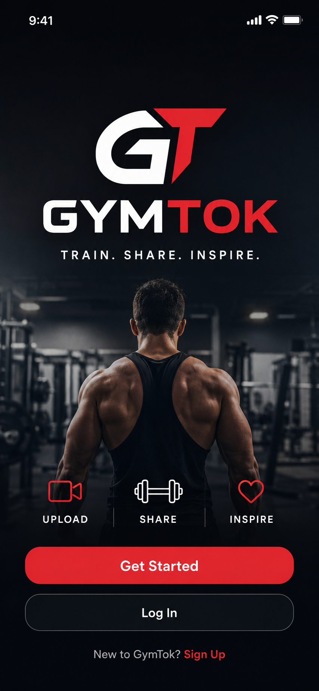
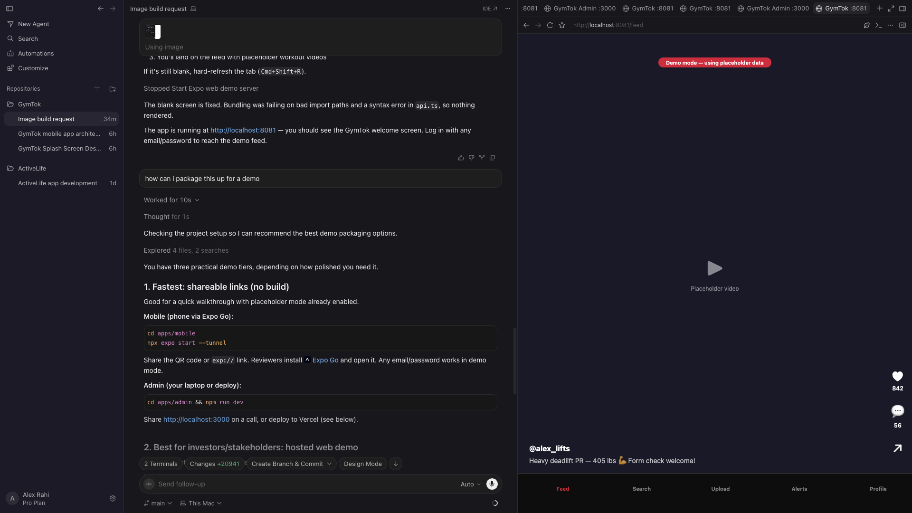
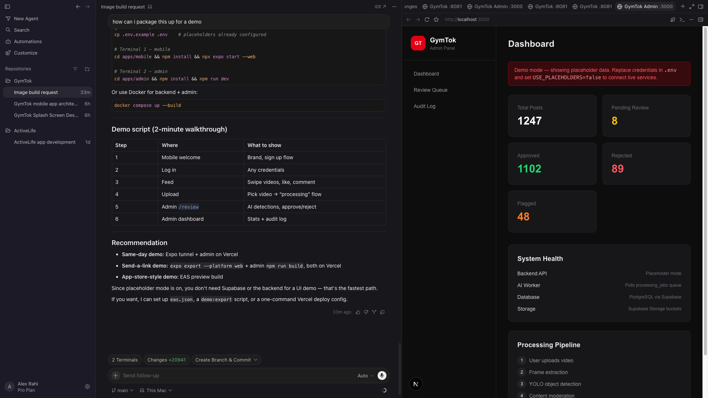

Project is live at https://gym-tok-demo-v3.vercel.app

# GymTok

**Cross-platform social fitness platform with AI-assisted content moderation**

GymTok is a full-stack fitness video platform: React Native mobile app, FastAPI backend, Next.js moderation dashboard, PostgreSQL schema, AI worker pipeline, Docker Compose, and Kubernetes manifests.

> **Mobile refactor (RecipeTok):** The Expo app was refactored to **RecipeTok** — a grid-only recipe photo app. Tabs are **Recipes | Upload | Profile**. Users browse a photo grid, upload recipe photos (meal prep / nutrition), and view their posts on Profile. The previous Watch scroll feed, Kitchen threads, and video/thread upload flows were removed; those routes redirect to Recipes.

> **Demo mode:** Runs with placeholder credentials — no cloud account required. See [Demo Guide](docs/DEMO_GUIDE.md).

## Demo Screens

### Mobile Welcome Screen



### Recipe Grid (RecipeTok)



### Moderation Dashboard



## Architecture

```
React Native (Expo)  ──HTTPS──▶  Supabase Auth (JWT)
       │                                │
       ▼                                ▼
   FastAPI Backend  ◀──────────▶  PostgreSQL + Storage
       │
       ▼
   AI Worker Pipeline (YOLO + Rules Engine)
       │
       ▼
   Admin Dashboard (Manual Review)
```

See [docs/ARCHITECTURE.md](docs/ARCHITECTURE.md) and [docs/MIGRATION_ASSESSMENT.md](docs/MIGRATION_ASSESSMENT.md) (AWS migration plan).

## Quick Start

```bash
cp .env.example .env
```

Keep placeholder mode enabled:

```env
USE_PLACEHOLDERS=true
EXPO_PUBLIC_USE_PLACEHOLDERS=true
```

| Service | Demo behavior |
|---------|---------------|
| **Mobile** | Log in with any email/password |
| **Admin** | Sample moderation stats + review queue |
| **Backend** | Accepts `Bearer placeholder-access-token` |

### Backend

```bash
cd backend
python3 -m venv .venv && source .venv/bin/activate
pip install -r requirements.txt
uvicorn app.main:app --reload --port 8000
```

### Mobile

```bash
cd apps/mobile && npm install && npx expo start --web
```

### Admin

```bash
cd apps/admin && npm install && npm run dev
```

### All services

```bash
docker compose up --build
```

## Documentation

- [Demo guide](docs/DEMO_GUIDE.md)
- [Architecture](docs/ARCHITECTURE.md)
- [AWS migration assessment](docs/MIGRATION_ASSESSMENT.md)
- [API documentation](docs/API_DOCUMENTATION.md)
- [Deployment guide](docs/DEPLOYMENT_GUIDE.md)
- [Interview one-pager](docs/INTERVIEW_ONE_PAGER.md)

## Tech Stack

| Layer | Technology |
|-------|-----------|
| Mobile | React Native, Expo, TypeScript |
| Backend | FastAPI, asyncpg, Pydantic |
| Admin | Next.js, Tailwind |
| AI | YOLOv8, rules engine |
| Deploy | Docker Compose, Kubernetes |
