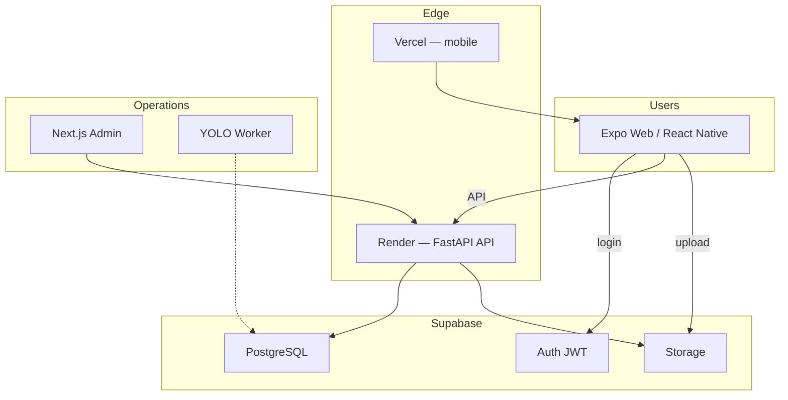

# GymTok

**TikTok-style social fitness app** — vertical video feed, category lanes, uploads, AI-assisted moderation.

**Live demo:** https://gym-tok-demo-v3.vercel.app

---

## Architecture

**Scale path:** Supabase MVP → EC2 t3.micro → RDS + S3 + CloudFront → SQS workers → EKS

---

## Tech stack

| Layer | Technology |
|-------|------------|
| Mobile | React Native, Expo, TypeScript |
| Backend | FastAPI, Python, Pydantic |
| Database | PostgreSQL (Supabase) |
| Auth | Supabase JWT |
| Storage | Supabase Storage → S3 |
| AI | YOLOv8, OpenCV, rules engine |
| Admin | Next.js, Tailwind |
| Deploy | Vercel, Render, Docker, Kubernetes |

---

## Screenshots

<table>
  <tr>
    <td align="center"><b>Workouts lane</b> </td>
    <td align="center"><b>For You feed</b> </td>
    <td align="center"><b>Upload</b> </td>
  </tr>
</table>

<i>← → category swipe · ↑ ↓ video scroll · video, photo, or thread uploads</i>

