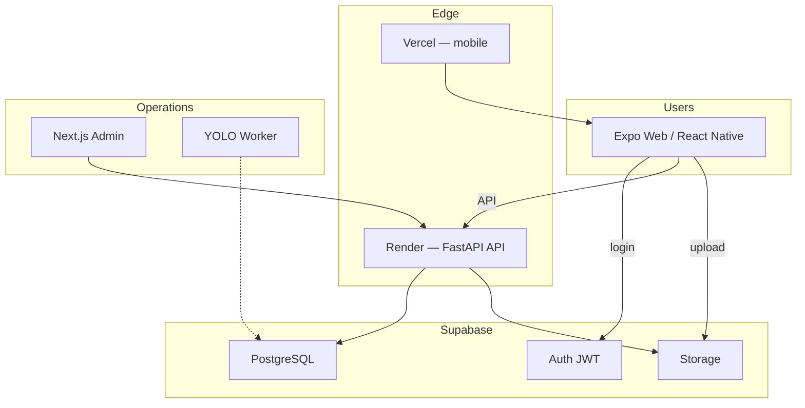
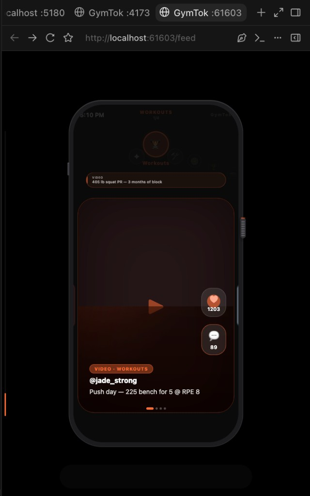
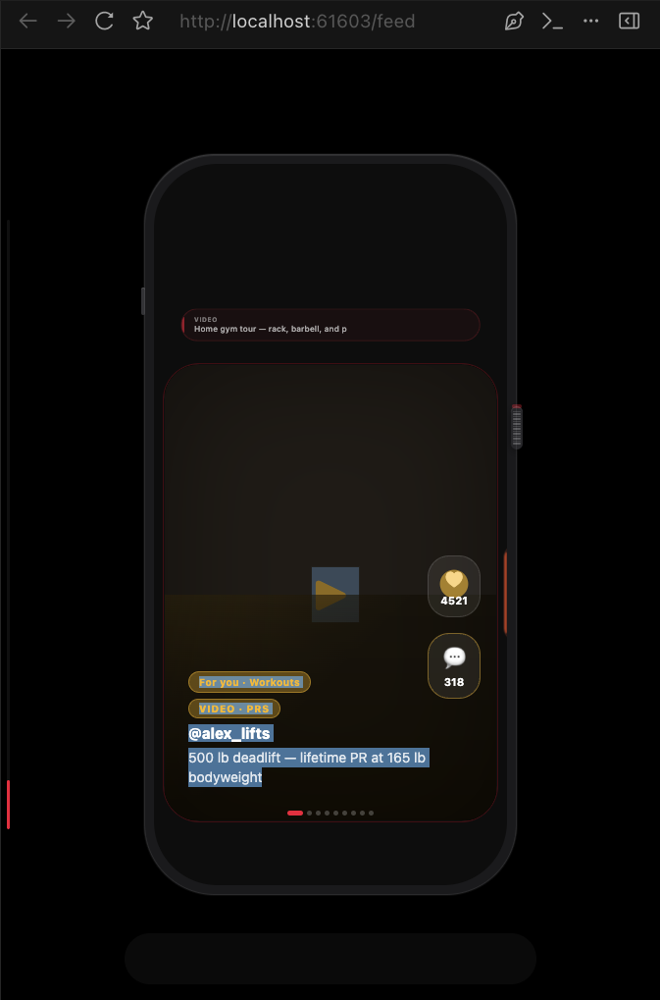
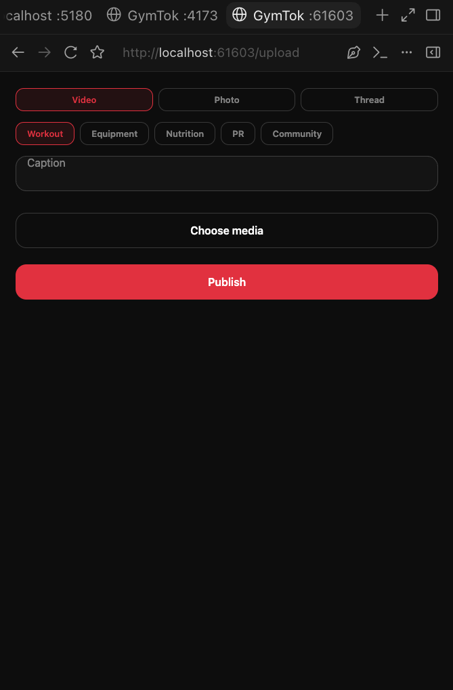

# GymTok

**TikTok-style social fitness app** — vertical video feed, category lanes, uploads, AI-assisted moderation.

**Live demo:** https://gym-tok-demo-v3.vercel.app

---

## Architecture

**Scale path:** Supabase MVP → EC2 t3.micro → RDS + S3 + CloudFront → SQS workers → EKS

**AWS build (Phase 2):** [docs/AWS_BUILD.md](docs/AWS_BUILD.md) · Terraform small stack under `infrastructure/terraform/environments/small/`

---

## Tech stack

| Layer | Technology |
|-------|------------|
| Mobile | React Native, Expo, TypeScript |
| Backend | FastAPI, Python, Pydantic |
| Database | PostgreSQL (Supabase) |
| Auth | Supabase JWT |
| Storage | Supabase Storage → S3 |
| AI | YOLOv8, Whisper, OpenCV, FFmpeg, rules engine |
| Admin | Next.js, Tailwind |
| Deploy | Vercel, Render, Docker, Kubernetes |

---

## Screenshots

<table>
  <tr>
    <td align="center"><b>Workouts lane</b> </td>
    <td align="center"><b>For You feed</b> </td>
    <td align="center"><b>Upload</b> </td>
  </tr>
</table>

<i>← → category swipe · ↑ ↓ video scroll · video, photo, or thread uploads</i>

---

## Interview talking points

### Main pitch

> Users upload fitness videos, and GymTok uses machine-learning models to filter both the video and audio content. YOLO analyzes sampled video frames, while Whisper transcribes spoken audio for text-based moderation. High-confidence results are processed automatically, while content that does not meet the minimum confidence threshold is sent for human review.

### Moderation framework

1. Users upload fitness videos.
2. FFmpeg extracts the audio and samples video frames.
3. YOLO analyzes the frames for inappropriate visual content.
4. Whisper converts spoken audio into a transcript.
5. A moderation engine checks the transcript for harmful language.
6. The system calculates confidence and risk scores.
7. High-confidence safe content is approved, high-confidence unsafe content is restricted, and low-confidence content is sent for human review.
8. Approved videos are stored in object storage and delivered through a CDN.

### Scaling

> Videos are processed asynchronously through a message queue, allowing moderation workers to scale independently from the application. Kubernetes horizontally scales the API and workers as traffic and queue depth increase. Object storage holds uploaded videos, a CDN delivers them efficiently, and caching reduces database load.

### Monetization

> GymTok uses a freemium model supported by in-feed advertising, premium ad-free subscriptions, promoted fitness content, trainer subscriptions and affiliate fitness-product commissions.

### Disclaimer

> ML-based moderation is not guaranteed to detect every violation and may produce false positives or false negatives. Low-confidence content is reviewed by a human, users can report published videos, and final decisions are governed by the platform’s moderation policies.
