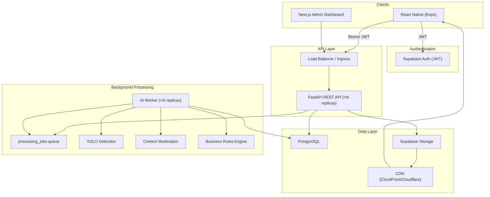

# GymTok Architecture

## System Overview

GymTok is a loosely coupled, independently scalable fitness social video platform.



## Service Boundaries

| Service | Responsibility | Scales By |
|---------|---------------|-----------|
| Mobile App | UX, video capture, feed playback | App store distribution |
| Supabase Auth | Registration, login, JWT, password reset | Supabase managed |
| FastAPI | Business logic, REST APIs, feed generation | Horizontal pod autoscaling |
| PostgreSQL | Users, posts, social graph, moderation data | Read replicas, connection pooling |
| Supabase Storage | Raw uploads, processed videos, thumbnails | Bucket policies, CDN origin |
| CDN | Global media delivery | Edge caching |
| AI Worker | Frame extraction, YOLO, moderation, rules | Queue depth HPA |
| Admin Dashboard | Manual review, audit, analytics | Static/SSR deployment |

## Upload Flow

1. Mobile app calls `POST /api/v1/posts` → creates post record + processing job
2. Mobile calls `POST /api/v1/posts/{id}/upload-url` → receives presigned URL
3. Mobile uploads video directly to Supabase Storage (bypasses API)
4. Mobile calls `POST /api/v1/posts/{id}/confirm-upload` → queues AI processing
5. Worker polls `processing_jobs`, downloads video, runs pipeline
6. Rules engine decides: publish, reject, age-restrict, or manual review
7. Approved content served via CDN

## AI Pipeline

```
Video → Frame Extraction (every 2s)
      → YOLO (person, gym equipment, movements)
      → Content Moderation (explicit, violence, nudity, unsafe)
      → Business Rules Engine
      → Decision (publish | reject | age_restrict | flag | manual_review)
```

## Security

- JWT validation on all authenticated endpoints
- Row Level Security on PostgreSQL via Supabase
- Admin dashboard protected by `X-Admin-Secret` header
- Presigned URLs for direct uploads (time-limited)
- CDN signed URLs for age-restricted content
- Input validation via Pydantic schemas

## Deployment

- **Local**: `docker compose up --build`
- **Production**: Kubernetes manifests in `k8s/` with HPA, ingress, secrets
- **CDN**: Configure via `infra/cdn-config.example.yaml`

## Placeholder Mode

Set `USE_PLACEHOLDERS=true` to run without real Supabase credentials. All services return realistic mock data for UI development and demos.
