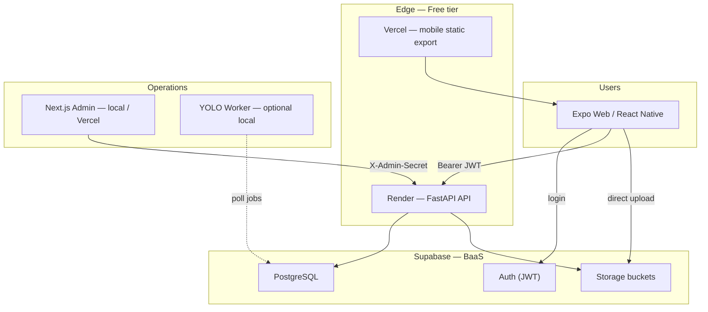
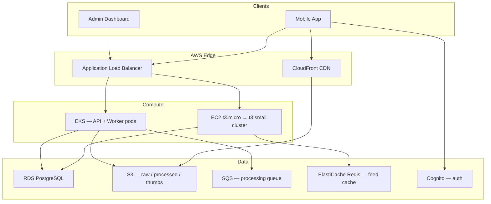

# GymTok — Interview Package

**Alex Rahi** · Social fitness video platform · Full-stack MVP with AI-assisted moderation

**Live demo:** https://gym-tok-demo-v3.vercel.app  
**Repo:** Private interview copy (mobile, API, admin, worker, schema, K8s)

---

## Elevator pitch (30 seconds)

GymTok is a TikTok-style fitness feed — vertical video, category lanes (Workouts, PRs, Meal Prep), photos, and community threads. I built the **mobile app**, **FastAPI backend**, **Postgres schema**, **YOLO + rules moderation pipeline**, and **admin review dashboard** as one system. The MVP runs on **Supabase + Render + Vercel** for $0; the architecture is designed to scale to **AWS** without rewriting business logic.

---

## Architecture diagram

### Current MVP (production path)



### Target scale architecture (AWS)



---

## Tech stack

| Layer | Technology | Why |
|-------|------------|-----|
| **Mobile** | React Native, Expo 57, TypeScript, Expo Router | One codebase → iOS, Android, web |
| **UI** | Custom design system (matte black, GymTok red, gold accents) | Brand-consistent feed + upload UX |
| **Auth** | Supabase Auth → JWT | Free tier, email/password, secure token storage |
| **API** | FastAPI, Python 3.12, Pydantic, asyncpg | Typed REST, OpenAPI docs, async DB pool |
| **Database** | PostgreSQL (Supabase) | Profiles, posts, social graph, moderation, review queue |
| **Storage** | Supabase Storage → S3 at scale | Presigned uploads, CDN-backed delivery |
| **AI pipeline** | OpenCV, Ultralytics YOLO, YAML rules engine | Frame extract → detect → moderate → decide |
| **Admin** | Next.js 16, React 19, Tailwind | Moderation queue, stats, audit log |
| **Analytics (Phase 1)** | AsyncStorage session events | Upload funnel, impressions, lane changes — client-only |
| **Local dev** | Docker Compose | Backend + worker + Postgres |
| **Prod (MVP)** | Vercel + Render + Supabase | $0/month interview / early users |
| **Prod (scale)** | EKS, Terraform, GitHub Actions | Horizontal scaling, IaC, CI/CD |

---

## Scaling path

Phased migration — **swap infrastructure, keep API contracts and business logic**.

| Phase | Infra | Cost (approx.) | Trigger |
|-------|--------|----------------|---------|
| **0 — Demo** | Placeholder mode, no cloud | $0 | Interview walkthrough, UI review |
| **1 — MVP** | Supabase + Render free + Vercel | $0–7/mo | First real users, manual moderation |
| **2 — Lift & shift** | **EC2 t3.micro** (API) + Supabase DB/Auth | ~$15–25/mo | Render cold starts, need 24/7 API |
| **3 — Data on AWS** | RDS PostgreSQL + S3 + CloudFront | ~$40–80/mo | Storage egress, connection limits |
| **4 — Async scale** | SQS queue + worker on t3.small | ~$80–150/mo | Upload volume, YOLO backlog |
| **5 — Cache & feed** | ElastiCache Redis, read replica | ~$150–300/mo | Feed latency, concurrent viewers |
| **6 — Orchestration** | EKS + HPA + Terraform | ~$300+/mo | Multi-region, team ops, SLAs |

### Phase 2 detail — EC2 t3.micro

```
Users → CloudFront (static) + ALB → t3.micro (FastAPI)
                                      ├── RDS or Supabase pooler
                                      └── S3 presigned uploads
```

- **t3.micro:** 2 vCPU burst, 1 GiB RAM — sufficient for FastAPI + connection pool at low QPS
- Upgrade to **t3.small** when CPU credits exhaust or p95 latency > 300ms
- Keep Supabase Auth initially; migrate to **Cognito** in Phase 3 to decouple BaaS

### What stays the same across phases

- REST API routes (`/api/v1/posts`, `/social`, `/admin`)
- Moderation rules (`workers/app/rules/config.yaml`)
- Admin review workflow (`review_queue` table)
- Mobile app — only env vars change (`EXPO_PUBLIC_API_URL`, auth provider)

See [MIGRATION_ASSESSMENT.md](./MIGRATION_ASSESSMENT.md) for full Supabase → AWS interface mapping.

---

## Monetization

### Near-term (MVP — 0–10K MAU)

| Stream | Model | Implementation |
|--------|--------|----------------|
| **Native ads** | CPM/CPC slots in feed | Already stubbed — `ad_impression` / `ad_click` analytics |
| **Creator boosts** | Pay to pin PR / workout in category lane | Stripe one-off; `posts.promoted_until` column |
| **Gym / brand profiles** | Verified badge + analytics dashboard | Admin-approved `profiles.trust_level` |

### Mid-term (10K–100K MAU)

| Stream | Model | Notes |
|--------|--------|-------|
| **GymTok Pro** | $4.99/mo — ad-free, advanced stats, upload priority | RevenueCat / Stripe subscriptions |
| **Affiliate equipment** | Amazon / Rogue links on detected gear (YOLO labels) | Disclosure on post metadata |
| **Program marketplace** | Coaches sell 4-week plans; 15% platform fee | New `programs` + `purchases` tables |

### Long-term (100K+ MAU)

| Stream | Model | Notes |
|--------|--------|-------|
| **Video transcoding tier** | Creator pays for 4K / faster processing | SQS priority queues |
| **Enterprise gym chains** | White-label feed + moderation API | Multi-tenant schema |
| **Data insights (aggregated)** | Anonymized trend reports for brands | Opt-in only, GDPR-aware |

### Metrics that drive revenue

Already tracked client-side (Phase 1 analytics):

- `video_impression`, `feed_lane_change` → ad placement optimization
- `upload_start` → `moderation_passed/flagged/rejected` → funnel for Pro upsell
- `ad_click` → CPC billing

Phase 2: persist events to Postgres / PostHog for creator dashboards and CPM reporting.

---

## Demo flow (7 minutes)

1. **Product** — Open https://gym-tok-demo-v3.vercel.app → For You feed, category swipe, PR caption
2. **Upload** — Photo/video form, disclaimer, moderation outcome messaging
3. **Backend** — `backend/app/main.py`, posts router, JWT middleware
4. **Moderation** — `workers/app/rules/engine.py`, human review queue
5. **Admin** — Dashboard stats, approve/reject (`apps/admin`)
6. **Scale** — This doc: Supabase → t3.micro → RDS/S3 → EKS
7. **Monetization** — Feed ads + Pro subscription path

---

## Screenshots

| Screen | File |
|--------|------|
| Welcome | `screenshots/01_welcome_screen.png` |
| Video feed | `screenshots/02_video_feed.png` |
| Admin dashboard | `screenshots/03_admin_dashboard.png` |
| For You feed (live) | `screenshots/04_feed_for_you.png` |

---

## Key files to open in interview

```
apps/mobile/app/(tabs)/feed.tsx          # Feed + categories
apps/mobile/src/components/feeds/        # FourWayFeed, ranking
backend/app/api/posts.py                 # Upload + feed API
backend/app/rules/engine.py              # Moderation decisions
workers/app/processor.py                 # YOLO pipeline
apps/admin/src/app/review/page.tsx       # Human review UI
supabase/migrations/001_initial_schema.sql
docs/ARCHITECTURE.md
docs/MIGRATION_ASSESSMENT.md
```

---

## Honest boundaries (what to say if asked)

- **Implemented:** Full MVP UX, API surface, schema, rules engine, admin UI, demo + production env path
- **Partial:** Live Supabase wired; Render backend optional; YOLO worker local-only
- **Not in scope:** Payment processing, Cognito migration, load tests, model accuracy benchmarks
